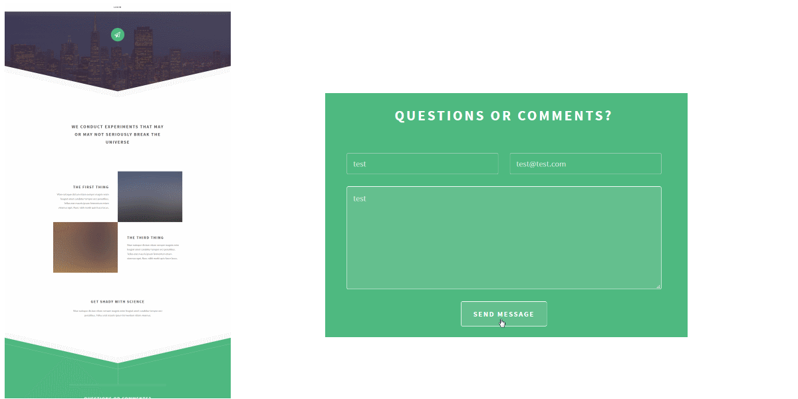

# NEBA Directive: a sample application for the NEBA framework for Apache Sling

This project demonstrates core concepts and features of the NEBA framework for Sling. 
It provides a demonstrative mini WEB application for the beautiful responsive _directive_ template set by [http://html5up.net](http://html5up.net).

## What this sample application is
This application demonstrates how NEBA can be used to model resources in Sling and use Spring's MVC features for Apache Sling.

## What this sample application is _not_ 
A ready-to-use web application. It has purely been designed to demonstrate NEBA features.
 
## How to run this application
You can run this app using docker. To build and run it from scratch, use the provided build-and-run script. 
If the launchpad is already build, you can start the app using

`docker-compose up`

Alternatively, you can use maven to build and run the app, like so:

1. Build the Neba Sample bundle in the root directory with `mvn install`
2. Build the Neba Sample Launchpad in the launchpad directory with `mvn install`
3. Start your Neba Sample Launchpad in the launchpad directory with `mvn  org.apache.sling:slingstart-maven-plugin:start` (Can be stopped again by pressing any key)

Once the app is up & running, you can for example:

- Open [http://localhost:8080/content/neba-sample.html](http://localhost:8080/content/neba-sample.html) or browse NEBA's 
   [Model registry](http://localhost:8080/system/console/modelregistry),[Model statistics](http://localhost:8080/system/console/modelstatistics) or examine logfiles using NEBA's [log viewer](http://localhost:8080/system/console/logviewer).
- login with any sling user, e.g. using admin/admin for the default administrative account.
- To configure the SMTP settings for the contact form, see /system/console/configMgr, "io.neba.sample.mail" and "NEBA sample project contact email sender".
- remote-debug the application via port 8000.
- When running in docker, a mailhog container lets you see contact emails generated by the contact mail form
  via mailhog's Web UI at http://localhost:8025.
 
## The anatomy of this app
The NEBA sample app is an OSGi bundle. It contains application code (Java POJOs, Services annotated with SCR metadata, NEBA models) in the "to.adapt.neba" package.

The bundle is [blueprint-enabled](http://www.eclipse.org/gemini/blueprint/) as it provides a blueprint context xml file in OSGI-INF/blueprint.

In addition, the bundle provides JCR content, views, images and configurations via [Sling content loading](https://sling.apache.org/documentation/bundles/content-loading-jcr-contentloader.html).
The respective content is contained in the SLING-INF/content folder and is loaded into the repository as specified by the `Sling-Initial-Content` header values defined in the pom.xml.

Furthermore, the bundle directly [provides static resources](https://sling.apache.org/documentation/bundles/bundle-resources-extensions-bundleresource.html) via the `Sling-Bundle-Resources` header value defined in the pom.xml.

All Neba models are considered part of the bundle's API, since the models are used by views. They are thus located in [to.adapt.neba.api.models](https://github.com/unic/neba-sample-project/tree/master/src/main/java/to/adapt/neba/api/models).
Here, the package "spring" contains Spring beans used as resource models, whereas "neba" contains standard Neba models as supported out of the box by Neba core. 
